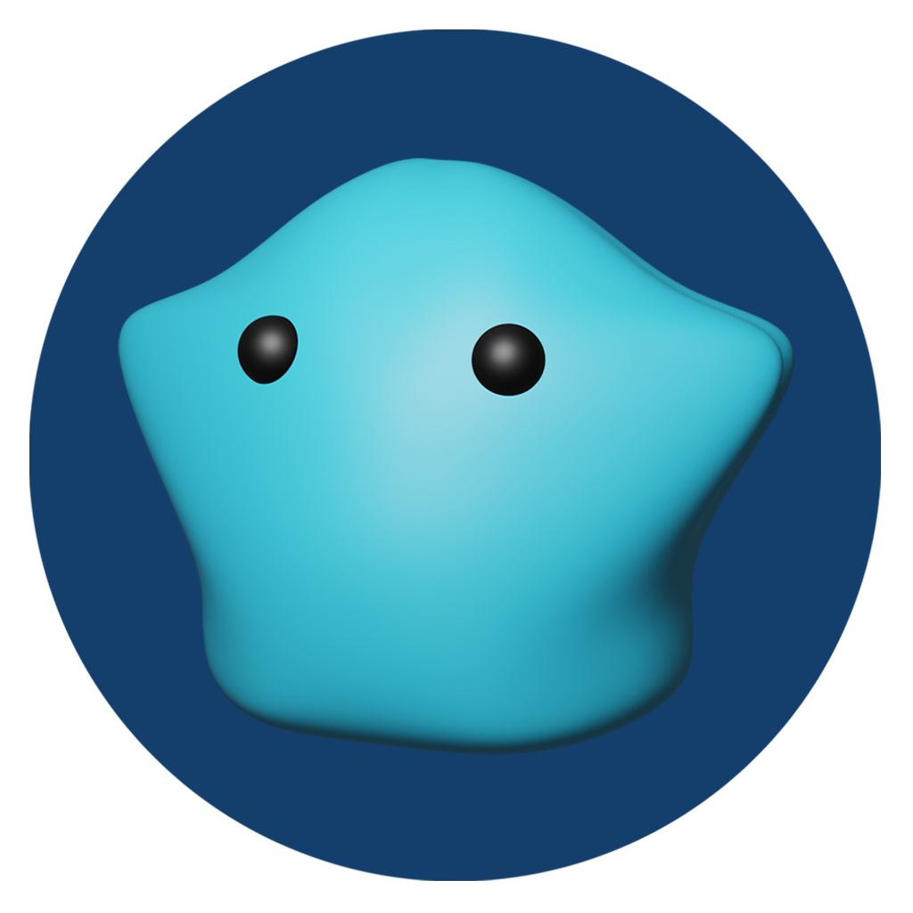
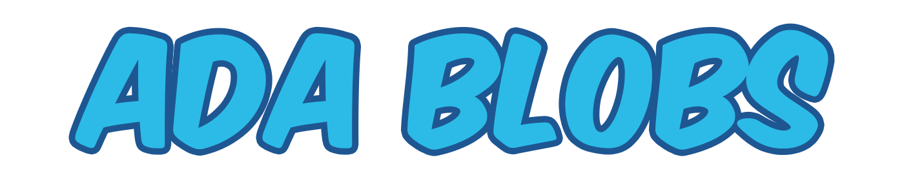

<h1 align="center">
  <a href="https://adablobs.io">
    
    
  </a>
</h1>
  
Welcome to [ADABlobs](https://adablobs.io/)! The cutest and most adorable NFT collection on Cardano. There are 300 Blob NFTs to collect with 1 new Blob being available each week until all 300 are released. ADA Blobs is the first auction marketplace on the Cardano Blockchain by leveraging Cardano's Plutus Smart Contract capability. This repository contains the full frontend implementation of the ADA Blobs website. The repository for the full Plutus Smart Contracts can be found [here](https://github.com/NicholasMaselli/ADABlobsPlutus)

### Community
The Blob Community is strong and growing! Check out our [Discord](https://discord.gg/hxMh4TxeW5) server to hear all the latest updates on the adorable Blobs and connected projects! You can also follow the ADA Blobs [Twitter](https://twitter.com/ADABlobs) for Blob updates as well =)

<div align="center">
  
  
</div>

### Validity

To make sure you have a real ADA Blob the Policy ID of your Blob must be:
**`4a4c17cc89b90f7239ce83f41e4f47005859870178f4e6815b1cd318`**

You can find the associated policy script in `./public/data/minting_policy.json`

The contract address for the official ADA Blobs auction market place is:
**`addr1w8qupuhmh3qwckr7dglaqkjr7qhruglem6anp49x9ey70wcrn3fa8`**

<div align="center">
  
  
</div>

### Metadata

ADA Blobs follows [CIP-25](https://github.com/cardano-foundation/CIPs/blob/master/CIP-0025/CIP-0025.md), the NFT metadata standard on Cardano. On-chain metadata for each blob is structured as the following:

```
{
  "721": {
    "4a4c17cc89b90f7239ce83f41e4f47005859870178f4e6815b1cd318": {
      "ADABlob1": {
        "color": "Blue",
        "hex": "2CBBE7",
        "id": 1,
        "image": "ipfs://QmXWRYfj5WPF942GWnJYbzPwX2LaAFBN1Wg2PkRGSCVoXV",
        "name": "Bob",
        "project": "ADA Blobs"
      }
    }
  }
}
```

Images are stored on IPFS and you find the image link to an ADA Blob inside the metadata.

<div align="center">
  
  
</div>

### Rarity

Unlike many NFT projects with a series of traits, an ADA Blob's rarity is based solely on their color. The "color" property of the on-chain metadata determines the rarity with the "hex" property indicating the exact shade of the Blob.

The rarity chart for the ADA Blob colors are as follows:


```
- White Blobs: 1.67% (5/300)
- Black Blobs: 3.34% (10/300)
- Brown Blobs: 5.00% (15/300)
- Red Blobs: 6.67% (20/300)
- Orange Blobs: 10.00% (30/300) 
- Yellow Blobs: 13.34% (40/300)
- Green Blobs: 16.67% (50/300)
- Blue Blobs: 20.00% (60/300)
- Purple Blobs: 23.34% (70/300)
```

You can find more rarity information on this [ADA Blobs page](https://adablobs.io/rarity).

<div align="center">
  
  
</div>

### Marketplace

The ADA Blobs marketplace can be used by anyone who wants to auction off their ADA Blob. The marketplace takes a 1% fee on ADA Blob auctions. The smart contract that is used by the ADA Blobs marketplace can be found in the [ADA Blobs Plutus](https://github.com/NicholasMaselli/ADABlobsPlutus) repository. 

<div align="center">
  
  
</div>

### Open Source

If you would like to pull this code and run it to see how it works. Follow these steps:

1. Clone this repository to a local directory

2. Ensure you have npm installed. Preferably the latest LTS version of npm or higher

3. Copy the template env file to an env file with the following command: 

```
cat config/template.env >> .env
```
<strong>Note:</strong> You may need to use "Windows Terminal" if you are on a Windows machine which you can get from the Windows Store.

4. Copy your [Blockfrost API](https://blockfrost.io/) credentials into .env file that you just created next to the "BLOCKFROST_API_KEY=" section:

5. Install npm packages with the following command:
```
npm i
```

6. Run the code and check it out with the following command:
```
npm run dev
```

