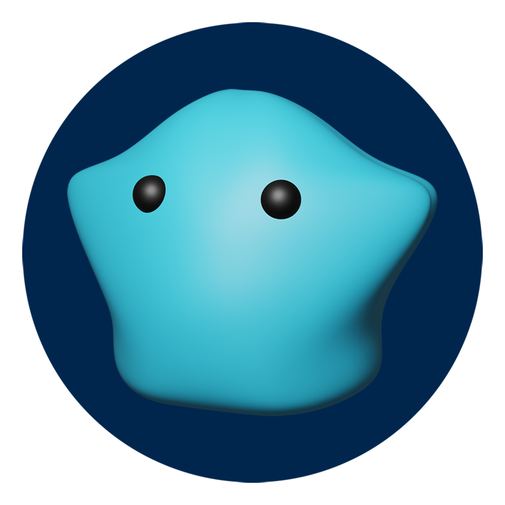

<h1 align="center">
  
</h1>
  
Welcome to [ADABlobs](https://adablobs.io/)! The cutest and most adorable NFT collection on Cardano. There are 300 Blob NFTs to collect with 1 new Blob being available each week until all 300 are released. ADA Blobs is the first auction marketplace on the Cardano Blockchain by leveraging Cardano's Plutus Smart Contract capability. This repository contains the full front implementation of the ADA Blobs website. The repository for the full Plutus Smart Contracts can be found here

  
  

The readme is currently under construction and will be completed 12/31/2021

